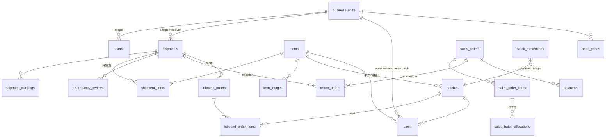
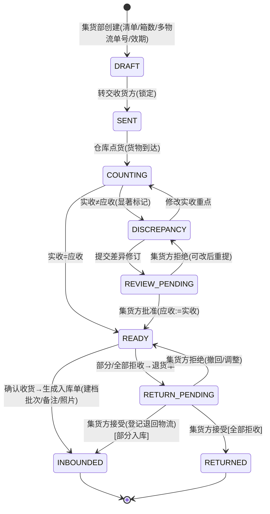
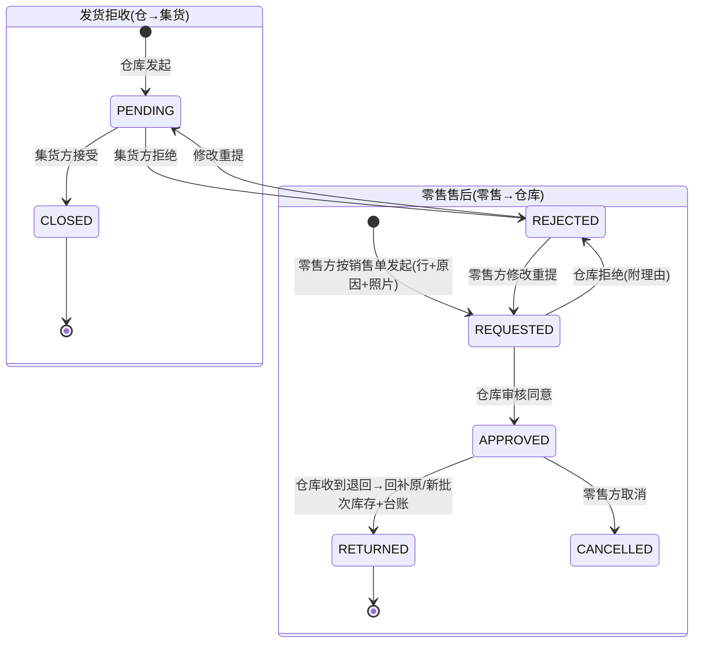
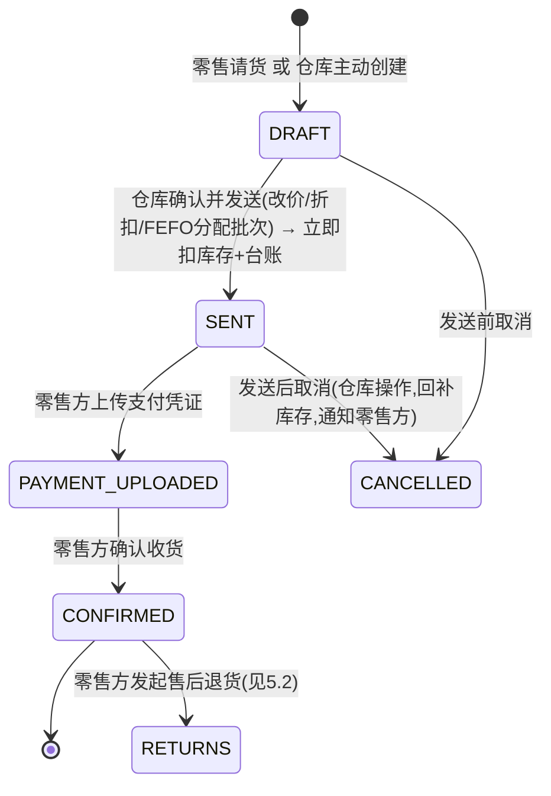

# OtunLink 仓储库存 ERP 系统设计文档

> 版本：v1.1 · 状态：待评审 · 定位：公司内部供应链协同系统（多集货部 → 多欧洲仓 → 多零售门店）
> 代码仓库：`C:\Codes\OtunLink`（P0 时初始化）
> 技术栈：Vite + React + TypeScript + Tailwind + Fluent UI (CF Pages) ｜ Hono + Drizzle (Cloudflare Workers + Hyperdrive + PostgreSQL) ｜ Azure AD (Entra ID) 免费版 OAuth ｜ R2 图片存储 ｜ 自建域名邮箱

---

## 1. 项目概述

### 1.1 背景与痛点

公司在中国大陆多地点集货（如上海、广州），通过专业货代发往欧洲多个仓库（如匈牙利、奥地利），再供给多家零售门店（如 XX 超市、YY 超市）。目前存在以下问题：

- 发货信息（物流商、多单号、箱数、货物清单、价格）散落在表格/聊天工具中，难以追踪
- 同一物品反复录入，规格（件/袋/盒/包、每包内含数）和图片无法复用
- 仓库收货时应收/实收核对靠人工，差异无法闭环跟踪
- 入库、出库、报损没有统一台账，库存数字"谁说改就改"，无法审计
- 零售价与采购价混淆；零售请货、送货、付款、收货、退货各环节缺乏单据化流程
- **食品类货物缺少有效期管理**：从集货环节未上报效期，仓库无法按批次追踪、无法及时发现并报损过期品

### 1.2 系统定位

一套**公司内部使用的私域 B2B 供应链协同 ERP**：让"集货方 → 仓库方 → 零售方"之间的单据流转、库存变动（按批次/效期）、价格管理全部线上化、可审计、双语（中/英）、多终端（桌面/手机/平板）可用。
仓库与零售之间的环节按**标准电商闭环**设计（下单 → 支付 → 发货/自提 → 收货 → 售后退货）；物流清关由专业货代外包，**系统不涉及报关/清关/单证**。

### 1.3 使用范围（已确认）

- **仅公司内部使用**：全员用公司自有 Azure AD（Entra ID）免费版账号登录（单租户 App Registration）
- **角色是岗位、对象是多个**：`集货部×N`（上海、广州…）、`仓库×N`（匈牙利仓、奥地利仓…）、`零售门店×N`（XX 超市、YY 超市…），业务单据必须落到具体业务单元
- **当前 B2B**，暂不含散户；未来可能开放 B2C（预留扩展点，不提前实现）
- 物流清关外包，不需要报关等细节

### 1.4 核心名词表

| 名词 | 英文 | 说明 |
|---|---|---|
| 业务单元 | Business Unit | 具体对象：集货部 / 仓库 / 零售门店，均多个 |
| 集货方 | Collector | 中国集货部门（上海/广州…），发货单创建者与发货方 |
| 仓库方 | Warehouse | 欧洲仓库（匈牙利/奥地利…），收货点货、库存、出入库、销售 |
| 零售方 | Retailer | 零售门店（XX/YY 超市…），请货、付款、收货、售后 |
| 物品 | Item | 全局共享物品目录（名称/条码/规格/图片），可复用 |
| 规格 | Spec | 计量单位（件/袋/盒/包…）+ 每包装内含数量（如 1 盒 = 12 个） |
| 发货单 | Shipment | 集货 → 仓库的单据，含多物流单号、箱数、应收清单、**效期** |
| 应收/实收 | Expected / Actual | 清单上的计划数量 / 仓库实际点货数量 |
| 差异修订 | Discrepancy Review | 仓库发起、集货方审批的数量调整请求 |
| 批次 | Batch | 同一物品的生产日期/到期日组合；食品必须建档 |
| 有效期 | Expiry | 生产日期 + 到期日（保质期），从集货端上报 |
| 入库单 | Inbound Order | 货物进入仓库（来源：发货单或手动），建档批次，原始价不可改 |
| 出库单 | Outbound Order | 货物离开仓库（普通出库/报损） |
| 报损单 | Loss Order | 特殊出库：损失原因 + 附图；支持过期批次一键报损 |
| 退货单 | Return Order | 两类：发货拒收（仓→集货）与 零售售后（零售→仓库） |
| 销售单 | Sales Order | 仓库 → 零售的单据，含送货方式、价格覆盖、折扣、批次分配 |
| 库存台账 | Stock Ledger | 所有库存数量变动的流水（按批次），唯一合法的改数量通道 |

### 1.5 目标与边界

**MVP 包含**：

- 认证与岗位角色、中英双语、响应式（手机/平板/桌面）、物品目录（含相机扫码、图片压缩上传/缩略图）
- 发货单（多物流单号、箱数、清单、**每行效期**、转交）
- 收货点货（实收、差异显著标记、差异修订审批流）
- 确认收货 → 入库单（**批次建档**、备注、入库照片）
- 发货拒收 → 退货单（仓 → 集货闭环）
- 手动入库/出库、报损单（原因+附图）、按批次库存台账、**过期追踪与一键报损**
- 零售价（仓库维度、可改、留历史）与入库原始价（不可改）
- 销售单（请货/主动送货、自提/快递、行级改价、整单折扣、FEFO 批次分配、发送即扣库存、支付凭证、确认收货）
- **零售售后退货**（申请 → 仓库审核 → 退回收货回补库存）
- 通知（站内 + 自建邮箱）、审计日志

**MVP 不含（后续迭代）**：

- B2C/散户、外部公司接入、多租户 SaaS（预留：`customers` 个体客户实体 + 销售单买家多态，见 8.10）
- 报关/清关/单证（外包货代负责）
- 库位管理、库存盘点单、序列号
- 汇率换算与多币种结算（单据固定单一币种，CNY/EUR/USD）
- 财务核算、物流费对账、BI 报表（仅基础库存/台账查询）
- 条码枪硬件（用手机相机扫码替代，键盘输入仍支持）

---

## 2. 总体架构

### 2.1 架构图

```
┌──────────────────────────────────────────────────────────────┐
│ 浏览器（桌面/手机/平板）                                        │
│  Vite React SPA: Fluent UI + Tailwind + i18n + React Query   │
│  MSAL 登录 → access token          BarcodeDetector 相机扫码    │
│  Canvas 图片压缩(前端)  IndexedDB 缓存(物品目录/已读)           │
└───────────────┬──────────────────────────────────────────────┘
                │ HTTPS (api.otunlink.com)
┌───────────────▼──────────────────────────────────────────────┐
│ Cloudflare（边缘，后端只做严格校验与轻计算）                     │
│  CF Pages: app.otunlink.com        CF Workers: api.otunlink  │
│   - 认证中间件(JWT/RBAC)  - 业务路由(REST /api/v1/*)           │
│   - 文件校验+R2 写入（无图像处理）  - 邮件适配器(HTTP 调用)       │
│   - Hyperdrive 绑定(连接池+查询缓存)  - KV(JWKS 缓存等)          │
│  CF R2 私有桶(原图+缩略图)  │  Cron: 过期批次扫描/通知           │
└───────────────┬──────────────────────────────────────────────┘
                │ Hyperdrive
┌───────────────▼──────────────────────────────────────────────┐
│ 私有 PostgreSQL（公司自有, Drizzle 迁移, 按批次库存）            │
└───────────────────────────────────────────────────────────────┘

外部: Microsoft Entra ID（免费版, 单租户 OAuth）
      自建域名邮箱 ↔ 轻量 HTTP↔SMTP 桥（部署在邮件服务器侧, 仅内网+鉴权）
```

### 2.2 技术选型

| 层 | 选型 | 理由 |
|---|---|---|
| 前端构建 | Vite + React 18 + TypeScript | 用户要求；SPA 部署 CF Pages |
| UI | Microsoft Fluent UI (react-components v9) | 用户要求；微软设计语言，自带中英文资源 |
| 样式 | Tailwind CSS v4 (`@tailwindcss/vite`) | 用户要求；Fluent 管组件、Tailwind 管布局/间距/自定义样式；响应式工具类 |
| 国际化 | react-i18next (zh-CN / en) + FluentProvider locale | 中英双语 |
| 扫码 | `BarcodeDetector`（原生 API）+ `@zxing/browser` 兜底 | 手机相机扫码即定位物品；不依赖硬件 |
| 前端数据/缓存 | TanStack Query + `persistQueryClient` + IndexedDB | 物品目录、基础字典离线缓存；减少服务端调用 |
| API 框架 | **Hono** (Cloudflare Workers) | 类型安全、原生 Workers 支持、zod 校验、开销小 |
| ORM/迁移 | Drizzle ORM + drizzle-kit | TS first、Hyperdrive 契合、迁移可管理 |
| 数据库 | 私有 PostgreSQL（公司自有） | Hyperdrive 访问；本地开发直连 DATABASE_URL |
| 认证 | Entra ID 免费版 OAuth2/OIDC（MSAL, PKCE） | 免费；单租户；jose 校验 JWT |
| 对象存储 | Cloudflare R2（私有桶 + 签名 URL） | 与 Workers 同栈；免费 10GB 足够 |
| 邮件 | **自建域名邮箱**（HTTP↔SMTP 桥适配器） | 已有域名邮箱；账号/凭证由你方管理 |
| 部署 | CF Pages + CF Workers（GitHub Actions CI） | 零服务器；预览环境 |
| 监控 | CF Analytics + 可选 Sentry | 免费档 |

### 2.3 域名、代码仓库与产物

- `app.otunlink.com` —— CF Pages（静态 SPA）
- `api.otunlink.com` —— CF Workers（Hono）
- Auth 回调：`https://app.otunlink.com/auth/callback`
- **代码仓库：`C:\Codes\OtunLink`**（新仓库，P0 初始化；本设计文档作为仓库 README/`docs/design.md` 一并落地）

### 2.4 成本

| 项 | 费用 |
|---|---|
| Azure AD (Entra ID) 免费版 | 0（上限 5 万对象；含安全默认值/MFA） |
| CF Pages / Workers 免费计划 | 0（100,000 请求/天；不够再升级） |
| Hyperdrive 免费档 | 0（100,000 次 DB 查询/天，UTC 0 点重置） |
| R2 | 免费 10GB / 100 万读 / 1000 万写月额 |
| PostgreSQL | 已有（私有） |
| 邮件 | 自有域名邮箱（0） |

> **成本控制原则**（用户要求"后端一定要节省开销"）：图片/计算全在前端；后端仅校验与轻业务；高频只读走 Hyperdrive 查询缓存 + 前端 IndexedDB 缓存 + 分页字段裁剪；JWKS/字典用 KV 缓存；避免 Worker 高 CPU 操作。免费档额度需监控，超限再评估。

---

## 3. 认证与权限

### 3.1 Azure AD (Entra ID) OAuth 流程

1. 公司 Entra ID 租户注册**单租户**应用 `OtunLink`
   - Platform: Web；Redirect URI: `https://app.otunlink.com/auth/callback`（本地加 `http://localhost:5173/auth/callback`）
   - 开放 `openid profile email`；API scope `api://<app-id>/OtunLink.API`
2. 前端 `@azure/msal-browser` 授权码 + PKCE；access token 1h（MSAL 自动续期）
3. **首次登录自动开户**：`GET /api/v1/auth/me` 校验 JWT → 查 `users`
   - 有记录 → 返回岗位、数据范围、语言偏好
   - 无记录 → 创建 `PENDING` 用户（sub/email/name），前端显示"等待管理员分配岗位"页
4. 管理员在「用户管理」分配**岗位**（集货/仓库/零售/管理员）与**可选数据范围**（具体业务单元），用户刷新即进入系统

### 3.2 权限模型

用户 = 岗位（决定能力）+ 数据范围（决定可见对象）。岗位与具体单元**解耦**，方便"一个仓管管多仓"或"店长只看本店"：

| 字段 | 说明 |
|---|---|
| `users.role` | `ADMIN` 管理员 / `COLLECTOR` 集货 / `WAREHOUSE` 仓库 / `RETAILER` 零售 |
| `users.scope_unit_id` | 可空；**空 = 本岗位全量**（内部协同默认）；非空 = 仅该业务单元（如某超市店长） |

| 能力 | COLLECTOR | WAREHOUSE | RETAILER | ADMIN |
|---|---|---|---|---|
| 物品搜索/新增/浏览/扫码 | ✓ | ✓ | ✓ | ✓ |
| 创建/编辑/转交发货单（可选具体集货部） | ✓ | 只读 | 只读 | ✓ |
| 绑定/查看多物流单号 | ✓ | ✓ | ✓ | ✓ |
| 点货（填实收） | 只读 | ✓ | ✗ | ✓ |
| 提交差异修订 | ✗ | ✓ | ✗ | ✓ |
| 审批/拒绝差异修订 | ✓ | ✗ | ✗ | ✓ |
| 确认收货 / 入库建档（批次/效期） | ✗ | ✓ | ✗ | ✓ |
| 发货拒收 → 退货单 | ✗ | ✓ | ✗ | ✓ |
| 处理发货退货单（接受/拒绝） | ✓ | ✗ | ✗ | ✓ |
| 手动入库/出库/报损（含过期报损） | ✗ | ✓ | ✗ | ✓ |
| 修改本仓库零售价 | ✗ | ✓ | ✗ | ✓ |
| 查看库存/零售价/批次效期 | ✗ | ✓ | ✓(只读) | ✓ |
| 请货/上传支付凭证/确认收货 | ✗ | ✗ | ✓ | ✓ |
| 创建/发送/取消销售单 | ✗ | ✓ | 草稿 | ✓ |
| **发起售后退货** | ✗ | ✗ | ✓ | ✓ |
| **审核/收货退回（回补库存）** | ✗ | ✓ | ✗ | ✓ |
| 用户/部门/审计管理 | ✗ | ✗ | ✗ | ✓ |

> 说明：数据对象（发货单、入库单、销售单等）一律引用具体 `business_unit_id`（上海集货部 / 匈牙利仓 / XX 超市），天然多实例、可查询、可审计。ADMIN 操作写入审计日志。

### 3.3 服务端鉴权（Worker）

- 中间件：`Authorization: Bearer` → `jose` 校验（JWKS 从 `login.microsoftonline.com/<tenant>/discovery/v2.0/keys` 拉取，KV 缓存 24h）→ 校验 `iss`（本租户）、`aud`（API scope）、`exp`
- 查 `users` 得 `{ userId, role, scopeUnitId }` 挂到 `c.var.auth`
- 模块中间件：`requireRole(...)`、`requireAdmin`、单据访问校验（`assertParticipant(order, auth)`：创建者或收发/买卖单元或 ADMIN，且 scope 匹配）
- 数据范围：`scope_unit_id` 为空 → 全量（本岗位）；非空 → 所有查询强制附加 `unit_id = scope_unit_id`（组合成 SQL `where AND`，避免泄漏）

---

## 4. 领域模型与业务规则

### 4.1 实体关系总览



### 4.2 核心实体定义

#### 业务单元 `business_units`（多实例）
`id, code, name, type(COLLECTOR/WAREHOUSE/RETAILER), address, contact, timezone, base_currency, is_active`
- 示例：`SH-CN 上海集货部`、`GZ-CN 广州集货部`、`WH-HU 匈牙利仓库`、`WH-AT 奥地利仓库`、`ST-XX XX超市`、`ST-YY YY超市`
- 仓库类额外：`warehouse_meta.address/contact`（用于快递运费、自提地址）；门店类额外：收货地址默认值

#### 用户 `users`
`id, entra_sub(唯一), email, name, role(ADMIN/COLLECTOR/WAREHOUSE/RETAILER), scope_unit_id(可空), status(ACTIVE/PENDING/DISABLED), locale, created_at`

#### 物品 `items`（全局共享目录，可复用）
| 字段 | 说明 |
|---|---|
| id, sku(可选内部编码), name | |
| barcode | 条码，ACTIVE 内 `UNIQUE`，可空；**扫码即按此精确定位** |
| spec_unit | `PIECE` 件 / `BAG` 袋 / `BOX` 盒 / `PACK` 包 / `SET` 套 / `OTHER` |
| inner_unit / inner_count | 内含单位与数量（1 盒 = 12 个） |
| is_perishable | **是否需效期管理**（食品类默认 true）：决定单据是否必填生产/到期日 |
| category, description, status, created_by, timestamps | |

> 数量约定：所有单据/库存以 `spec_unit` 计；内含数仅展示换算。**批次粒度**：食品必建批次（生产日期+到期日）。

#### 发货单 `shipments`
`shipment_no(SH-...), shipper_unit_id, receiver_unit_id, status, boxes_count, currency, expected_arrival_date, remark, sent_at, created_by, ...`
- `shipment_trackings`：`carrier, tracking_no(唯一), note` —— 一单多物流公司/多单号
- `shipment_items`：`item_id, 名称/规格快照, expected_qty 应收, actual_qty 实收(可空), unit_price, production_date, expiry_date(食品必填; 一行一批, 多批拆行), line_note`
- 差异状态：`actual_qty <> expected_qty` → **显著标记**（红色行 + 差 N 徽标 + 顶部警示）

#### 批次 `batches`
`id, item_id, batch_no(可空), production_date, expiry_date, source_type(SHIPMENT/MANUAL), source_order_id, created_by, created_at`
- 入库时按"物品 × 效期"建档；同一物品不同效期 = 不同批次；库存按批次统计
- `expiry_date IS NOT NULL` 时，库存页按剩余天数着色（≤30 天黄、已过期红）；**已过期批次支持快捷生成报损单**

#### 差异修订 `discrepancy_reviews`
同 v1.0：`PENDING/APPROVED/REJECTED`；批准 → `shipment_items.expected_qty := actual_qty`（审计）；同一发货单同时仅一个 PENDING（部分唯一索引）；附原因/照片。

#### 入库单 `inbound_orders`
`inbound_no(IB-...), source_type(SHIPMENT/MANUAL), shipment_id?, warehouse_unit_id, counterparty_unit_id, status(DRAFT/POSTED), remark, posted_by/at, 照片`
- `inbound_order_items`：`item_id, batch_id(建档: 生产/到期日/批号), qty, unit_cost(原始价不可改), line_note`
- **原始价铁律**：`unit_cost` 创建后只读；成本历史由台账/入库单承载

#### 出库单 `outbound_orders`
`outbound_no(OB-...), type(NORMAL/LOSS), warehouse_unit_id, counterparty_unit_id(可空=内部), status(DRAFT/POSTED), remark, posted_by/at`
- `outbound_order_items`：`item_id, batch_id, qty, unit_cost(自动带出)`
- LOSS：`loss_reason(必填), photos`；**"从过期批次创建"**：库存页筛出 `expiry_date < now` 批次 → 一键预填报损单
- 出库（含报损）默认可选批次；普通出库建议按 FEFO 提示；报损必须指定批次（追溯损失来源）

#### 退货单 `return_orders`（两类）
| 字段 | 说明 |
|---|---|
| return_no(RT-...) | |
| source_type | `SHIPMENT`（发货拒收：仓→集货）/ `SALES`（零售售后：零售→仓库） |
| shipment_id? / sales_order_id? | 来源单据 |
| from_unit_id / to_unit_id | 方向随 source_type |
| status | SHIPMENT: `PENDING→CLOSED/REJECTED`；SALES: `REQUESTED→APPROVED/REJECTED→RETURNED(回补库存)/CANCELLED` |
| reason, note, photos, 退回物流信息(可选) | |

- `return_order_items`：`item_id, qty, 原批次(售后退货尽量按原批次回补; 无法识别则新建"退货批次"标注), reason`
- 售后流程：零售方按销售单发起（整单/部分行）→ 仓库审核（同意/拒绝附理由）→ 同意后零售方寄回/自提退回 → 仓库**确认收退货** → 库存按原批次回补 + 台账 `RETURN_IN` + 通知（退款线下对账，单据记录备注）

#### 销售单 `sales_orders`
| 字段 | 说明 |
|---|---|
| sales_no(SO-...), seller_unit_id, buyer_unit_id | |
| source | `RETAILER_REQUEST` 请货 / `WAREHOUSE_INITIATED` 主动送货 |
| delivery_method | `PICKUP` 自提 / `EXPRESS` 快递 / `LOGISTICS` 物流 + 地址 + 运费 |
| discount_percent | 整单折扣 0–100 |
| currency, total_amount | Σ(行价×量) × (1−折扣%) + 运费 |
| status | 见 5.5 |
| 批次 | `sales_order_items` → `sales_batch_allocations(order_item_id, batch_id, qty)`：发送时**自动 FEFO**（先到期先出）按批次分配，可手工指定；跨批自动拆分配记录 |

`sales_order_items`：`item_id, qty, list_price(零售价快照), price(成交价, 仓库可改), line_total`

#### 付款 `payments`
`sales_order_id(唯一), amount, currency, method_note, proof_file_id(凭证), refund_note(退款线下备注, 可空), uploaded_by(RETAILER), uploaded_at`

#### 库存 `stock`（仓库×物品×批次）
`unit_id, item_id, batch_id, qty(>=0), avg_cost, version` · `PK(unit_id, item_id, batch_id)`
- 汇总视图：按物品聚合（含各批次明细、总效期最短日期）

#### 零售价 `retail_prices`
`unit_id(仓库), item_id, price, currency, updated_by, updated_at` + `retail_price_history`

#### 库存台账 `stock_movements`（只增不改删）
`id, unit_id, item_id, batch_id, type, qty_delta, qty_before, qty_after, unit_cost, order_type, order_id, ref_no, note, operator_id, created_at`
- `type`: `INBOUND_SHIPMENT / INBOUND_MANUAL / OUTBOUND_NORMAL / OUTBOUND_LOSS / OUTBOUND_SALE / OUTBOUND_SALE_REVERSAL / RETURN_IN / RETURN_OUT`

#### 其他
`files(key, thumbnail_key, mime, size, w,h)` · `notifications(user_id或unit_id, type, title, content, link, read_at)` · `audit_logs(user_id, action, entity_type, entity_id, before/after jsonb, ip)` · `email_logs(可选追踪)`

### 4.3 全系统铁律（业务规则）

1. **数量只能通过单据改变**：任何数量变更经 `stock_movements`（含批次维度）；不存在"直接改数字"API
2. **原始价不可变**：入库单 `unit_cost` POSTED 后只读
3. **零售价独立可改**：仓库×物品维度，可随时改（留历史），与采购价互不影响
4. **食品必跟批次**：`is_perishable` 物品的入库、发货、销售、报损全部按批次；效期从集货上报
5. **FEFO**：销售/普通出库默认先到期先出（自动分配批次），可人工指定；报损按批追溯
6. **单据快照**：订单行存名称/规格快照，物品库修改不污染历史
7. **所有写操作**：zod 校验 + 审计日志；时间 UTC 存储、按单元时区渲染

### 4.4 币种与换算

单据各自持有 `currency`（CNY/EUR/USD），`NUMERIC(12,2)`；MVP 不做汇率换算；跨币种仅标注展示。

---

## 5. 业务流程（状态机）

### 5.1 发货单生命周期（同 v1.0，新增效期字段）



### 5.2 退货单（两类）



### 5.3 入库单（含批次建档）

`DRAFT`（确认收货自动生成/手动创建，行含批次=生产/到期日）→ `POSTED`（校验 → 建/关联 `batches` → 写台账 → 加库存）。原始价与批次信息 POSTED 后只读。

### 5.4 出库单 / 报损单

`DRAFT`（普通：交易对手+明细；报损：原因+附图+明细，**必须指定批次**）→ `POSTED`（校验库存 → FEFO/指定批扣减 → 台账）。过期批次列表提供"一键生成报损草稿"。

### 5.5 销售单 / 请货 / 售后



**关键规则**：SENT 瞬间按 `sales_batch_allocations` 扣减对应批次库存（台账 `OUTBOUND_SALE`）；取消回补（`OUTBOUND_SALE_REVERSAL`）；零售方可见所选仓库库存（含效期）与零售价（只读）。

### 5.6 库存变动统一入口

`postStockMovement(pool, { unitId, itemId, batchId, delta, cost, orderRef })` —— 事务内 `SELECT ... FOR UPDATE` 锁行 → 校验非负 → 更新 `stock(avg_cost 加权)` → 插入台账。所有新业务（盘点/退货入仓等）复用该函数。FEFO 分配也在此函数输出（按 `expiry_date ASC` 分配）。

---

## 6. 模块划分与页面/API

### 6.1 前端页面（apps/web，响应式：桌面/平板/手机）

| 路由 | 页面 | 说明 |
|---|---|---|
| `/login` `/auth/callback` | 登录/回调 | MSAL |
| `/` | 工作台 | 待办聚合：待点货/待处理差异/待处理退货/待发送/待确认凭证/待处理售后/过期批次预警 |
| `/shipments` `/shipments/:id` | 发货单 | 清单含**效期列**；应收/实收并排+差异高亮；物流单号卡片；操作按钮 |
| `/items` | 物品目录 | 搜索（名称/条码）、**相机扫码即定位**、新增/编辑、图片上传、规格、`is_perishable` |
| `/inbound` | 入库单 | 列表/详情/手动新建；**批次建档（生产/到期日/批号）**；原始价只读展示 |
| `/outbound` | 出库单 | 普通/报损 Tab；报损必填原因+图；**过期批次一键报损** |
| `/returns` | 退货单 | 两类来源统一列表（发货拒收/售后）；集货/仓库/零售各自可操作入口 |
| `/sales` `/sales/:id` | 销售单 | 请货、创建、改价/折扣、**批次分配预览（FEFO）**、发送、支付凭证、确认收货、**发起售后** |
| `/inventory` | 库存 | 按仓库：物品汇总+**批次明细（效期着色）**+台账；零售价设置+历史 |
| `/notifications` | 通知中心 | 站内通知（含效期预警） |
| `/admin/users` `/admin/units` | 管理 | 用户分配岗位/数据范围；业务单元管理（多实例）；审计日志 |
| 全局 | 响应式 | 移动优先断点（<768 / 768–1024 / >1024）；表格在手机转卡片列表；Fluent 组件均支持触控；底部导航（手机） |

### 6.2 后端 API（apps/api，`/api/v1`）

响应 `{ data }` / `{ error: { code, message, details } }`；分页 `?page=&size=&q=`。

| 模块 | 主要端点 |
|---|---|
| auth | `GET /auth/me` |
| users/units | `GET/PATCH /users/me` · `GET/POST /admin/users` · `PATCH /admin/users/:id` · `GET /units` · `GET/PATCH /admin/units` |
| items | `GET /items?q=` · **`GET /items/by-barcode?code=`(扫码)** · `POST/PATCH /items/:id` · `POST /items/:id/images` |
| files | `POST /files`(multipart, 仅校验: 魔数/尺寸) · `GET /files/:id/url`(签名) |
| shipments | `GET/POST /shipments` · `GET/PATCH /shipments/:id` · `POST /shipments/:id/send|start-counting|count|confirm-receipt|returns` · `POST /reviews/:id/approve|reject` |
| inbound | `GET/POST /inbound-orders` · `GET /inbound-orders/:id` · `POST /inbound-orders/:id/post`（建档批次） |
| outbound | `GET/POST /outbound-orders` · `POST /outbound-orders/:id/post` · `GET /stock/expired?unitId=`(过期批次) |
| returns | `GET /return-orders` · `POST /return-orders/:id/approve|reject`(售后审核) · `POST /return-orders/:id/receive`(退回收货→回补) · `POST /return-orders/:id/accept|reject`(发货拒收处理) |
| sales | `GET/POST /sales-orders` · `GET /sales-orders/:id` · `PATCH`(草稿) · `POST /sales-orders/:id/send|cancel|confirm-receipt` · `POST /sales-orders/:id/payments` · `POST /sales-orders/:id/returns`(发起售后) |
| stock | `GET /stock?unitId=` · `GET /stock/movements` · `GET /stock/batches`(效期) · `GET/PUT /retail-prices` · `GET /retail-prices/:unitId/:itemId/history` |
| notifications | `GET /notifications` · `POST /notifications/read` |
| audit/email | `GET /admin/audit-logs` · `POST /admin/test-email`(邮件连通性) |

### 6.3 前端工程结构（Monorepo）

```
C:\Codes\OtunLink\
├─ apps/
│  ├─ web/          # Vite React SPA（Fluent UI + Tailwind + i18next + React Query + MSAL + BarcodeDetector）
│  └─ api/          # Hono Worker（routers/services/db/middleware/tests）
├─ packages/
│  ├─ shared/       # 类型、zod schema、常量、错误码、i18n 字典
│  └─ db/           # Drizzle schema + migrations + 类型
├─ infra/           # 自建邮箱 HTTP↔SMTP 桥（轻量 Node 服务, 部署于邮件服务器侧）
├─ wrangler.toml / wrangler.pages.toml
└─ .github/workflows/ci.yml + deploy.yml
```

---

## 7. 数据库设计（Drizzle 表清单）

> `TIMESTAMPTZ` UTC；金额 `NUMERIC(12,2)`；主键 `uuid`。

| 表 | 关键列 / 约束 |
|---|---|
| `business_units` | code unique, type enum, timezone, base_currency |
| `users` | entra_sub unique, role enum, scope_unit_id fk nullable, status |
| `items` | barcode(partial unique active), spec_unit, inner_unit, inner_count, **is_perishable**, status |
| `item_images` / `files` | 与 v1.0 相同 |
| `shipments` | shipment_no unique, shipper/receiver fk, status, boxes_count, currency |
| `shipment_trackings` | carrier, tracking_no, unique(carrier,tracking_no) |
| `shipment_items` | item_id, 快照列, expected_qty, actual_qty, unit_price, **production_date, expiry_date** |
| `discrepancy_reviews`(+items/photos) | 同 v1.0（每发货单仅一个 PENDING 约束） |
| `batches` | **item_id, batch_no, production_date, expiry_date, source_type, source_order_id** |
| `inbound_orders`(+items/photos) | source_type, shipment_id?, **item 行含 batch_id**, unit_cost 只读 |
| `outbound_orders`(+items/photos) | type(NORMAL/LOSS), loss_reason, **item 行含 batch_id** |
| `return_orders`(+items/photos) | **source_type(SHIPMENT/SALES), shipment_id?, sales_order_id?**, status 按类型 |
| `sales_orders` | source, delivery_method, discount_percent, freight, currency, total, status |
| `sales_order_items` | list_price, price, line_total |
| `sales_batch_allocations` | **order_item_id, batch_id, qty**（FEFO 拆分） |
| `payments` | sales_order_id unique, amount, proof_file_id, refund_note |
| `stock` | PK(unit_id,item_id,batch_id), qty, avg_cost, version |
| `stock_movements` | **batch_id**, type, delta, before/after, unit_cost, order ref, operator |
| `retail_prices` / `retail_price_history` | 同 v1.0 |
| `notifications` / `audit_logs` | 同 v1.0 |
| `email_logs`（可选） | 收件人/主题/状态/时间，用于邮件排障 |

**迁移策略**：`drizzle-kit generate`；迁移执行器打包进 Worker，`POST /api/v1/admin/migrate`（ADMIN + 密钥）运行；本地开发直连 `DATABASE_URL`。

---

## 8. 关键技术方案

### 8.1 图片上传与压缩（全前端，后端只校验）
- 前端 Canvas 压缩：原图 ≤1600px / JPEG 0.8（≤2MB），同时生成 320px 缩略图 → `POST /files`（两个字段）
- 后端仅做严格校验：`content-type` + 魔数（JPEG/PNG/WebP）+ 尺寸/大小上限 → 写 R2 私有桶（UUID key）
- 读取：`GET /files/:id/url` 返回 15 分钟签名 URL；列表用缩略图 key
- 后端**零图像处理**（不用 sharp/wasm），节省 Worker 计算与冷启动

### 8.2 库存并发与一致性（按批次）
- 事务：`BEGIN` → `SELECT ... FOR UPDATE`（stock 行，含批次）→ 余额校验 → `UPDATE stock` → `INSERT stock_movements` → `COMMIT`
- 销售发送：同一事务完成 FEFO 分配写 `sales_batch_allocations` + 扣批次库存 + 状态更新
- 差异审批：`UPDATE ... WHERE id=? AND status='PENDING'` 判断影响行数防重复
- 前端 React Query `staleTime` + 变更后失效重取

### 8.3 国际化 i18n
- `react-i18next`；`locales/zh-CN.json`、`en.json`（packages/shared）
- 顶部切换 → `users.locale` + localStorage；`FluentProvider locale={zhCN|enUS}` 同步 Fluent 文案
- 后端只返回 `error.code`；日期用 `date-fns` + 单元时区格式化

### 8.4 单据编号
`前缀-YYYYMMDD-4位序号`（SH/IB/OB/RT/SO），数据库序列 + 唯一索引兜底。

### 8.5 通知
- 站内：转交、差异、退货、售后、销售、入库/出库、**效期预警**（Cron 每日扫描即将过期/已过期批次写通知）
- 邮件：`EmailProvider` 接口 → **自建邮箱桥**（见 8.8）；仅配置后启用；失败写 `email_logs` 不阻塞主流程

### 8.6 API 约定与错误码
zod 400 `VALIDATION_ERROR`；401 未登录；403 `FORBIDDEN`；409 业务冲突（`INSUFFICIENT_STOCK`、`REVIEW_ALREADY_PROCESSED`、`BATCH_EXPIRED`…）；统一中间件：鉴权 → 审计挂钩 → 校验 → handler → 错误映射。

### 8.7 手机相机扫码（条码）
- 优先 `BarcodeDetector` API（Chrome/Edge/部分移动浏览器原生支持）；不支持时回退 `@zxing/browser`（摄像头 + wasm 解码）
- 交互：物品页"扫一扫" → 授权摄像头 → 检测到条码 → 调 `GET /items/by-barcode` → **立即跳转到该物品**（不存在则预填条码引导新建）
- 录入框支持直接手输条码；相机流及时释放（功耗与隐私）

### 8.8 邮件（自建域名邮箱）
- Workers **无法直连 SMTP**（无 TCP），采用两种适配之一：
  1. **推荐**：在你们邮件服务器侧部署 `infra/mail-bridge`（轻量 Node 服务，约 300 行，仅内网监听 + API Key 鉴权，负责 HTTP→SMTP 转发），Worker 用 `fetch` 调用 `MAIL_BRIDGE_URL`
  2. 若邮件服务商提供 HTTP API（如企业邮开放接口），直接实现适配器替换
- 配置：`MAIL_PROVIDER=bridge|api`、`MAIL_FROM`（如 `noreply@otunlink.com`）、模板（中文为主，`Accept-Language` 提供英文版）
- 发送全部异步、失败重试 1 次、`email_logs` 记录

### 8.9 前端缓存与后端瘦身（成本原则）
- **前端**：TanStack Query `persistQueryClient` + IndexedDB —— 物品目录、单位字典、已读通知、列表第一页等缓存；新增/变更后失效重取；网络差时读缓存（只读数据可离线查看）
- **后端**：无重计算；列表固定分页 ≤50 + 字段裁剪（`SELECT` 指定列）；Hyperdrive 查询缓存用于只读高频查询；JWKS/字典 KV 缓存；DB 索引覆盖列表筛选；不必要的聚合放前端
- 图片来源：直接签名 URL/CDN，不经过 Worker 二次处理

### 8.10 未来 B2C 扩展点（本期不实现）
- 预留 `customers`（个体客户）实体；`sales_orders` 买方字段改为多态 `buyer_type(UNIT/CUSTOMER) + buyer_id`（迁移脚本 P9 后提供）
- 售后/支付流程天然复用；届时仅需新增客户管理与下单入口

---

## 9. 非功能需求

| 项 | 要求 |
|---|---|
| 响应式 | 移动优先：320px 起；表格手机转卡片；Fluent 触控友好；底部导航（手机）；PWA 基础（manifest + 图标，离线仅缓存静态壳） |
| 性能 | 列表 P95 < 500ms；分页 ≤50；图片走 R2 直链；前端缓存命中优先 |
| 安全/隐私 | 全程 HTTPS + HSTS + CSP（无第三方脚本）；JWT + RBAC + 数据范围；R2 私有桶签名访问；文件魔数白名单；摄像头权限最小化、用后释放；邮件桥内网+API Key；Entra 开启安全默认值（MFA）；审计关键操作；数据最小化收集（仅 email/姓名/单元） |
| 可用性 | CF 全球边缘；私有 PG 由公司侧保障备份/监控 |
| 备份 | PG 每日备份（公司侧）；台账只追加降低误操作 |
| 成本 | 免费档为主：后端轻计算（验证优先）、缓存层、查询频率监控；Worker 免费 10 万请求/天、Hyperdrive 10 万查询/天需监控 |
| 监控 | CF Analytics + `email_logs`/`audit_logs` 查询；可选 Sentry |
| 兼容 | Chrome/Edge/Safari 最近两版；BarcodeDetector 不支持时 zxing 兜底 |

---

## 10. 分阶段实施计划

> 在 `C:\Codes\OtunLink` 中实施。每阶段有可验收交付物；P1–P3 顺序依赖，P4 起部分可并行。

| 阶段 | 主题 | 交付物 / 验收标准 |
|---|---|---|
| **P0** | 项目脚手架 | 在 `C:\Codes\OtunLink` 初始化 Monorepo（web/api/shared/db）；Wrangler/Pages 配置；GitHub Actions CI（typecheck+test+build）；preview/prod 部署通；README（本文档落地 `docs/design.md`） |
| **P1** | 数据库与基础设施 | Drizzle 全量表 + 迁移可执行；Hyperdrive 绑定 + 本地开发连接；**私有 PG 可达性验证**（先行）；迁移执行器 |
| **P2** | 认证与岗位/单元 | Entra App Registration 指南 + MSAL 登录；`/auth/me` 自动开户；管理员分配岗位 + 数据范围；RBAC 中间件；PENDING 引导页 |
| **P3** | 前端骨架 | Fluent Provider + Tailwind 布局/导航/**响应式断点与移动端适配**；中英切换；路由守卫按岗位；React Query + persist 缓存封装；错误码映射 |
| **P4** | 物品目录 + 图片 + 扫码 | items CRUD + 搜索复用 + 规格 + `is_perishable`；图片压缩上传 + 缩略图 + 签名 URL；**相机扫码（BarcodeDetector/zxing）即定位** |
| **P5** | 发货单 | 创建（多物流单号/箱数/清单/复用物品/**效期上报**）+ 转交；列表/详情/快照；权限 |
| **P6** | 收货点货 + 差异 | 开始点货/逐项实收/差异显著标记；差异修订提交/审批/拒绝 → 应收按实收修订（审计） |
| **P7** | 确认入库 + 发货退货 | 确认收货自动生成入库单（**批次建档**/备注/照片/POST）；拒收退货单 + 集货方处理闭环 |
| **P8** | 库存平台 | 手动入库/出库/报损（指定批次）；按批次台账与库存页（**效期着色**）；**过期批次扫描与一键报损**；零售价管理 + 历史；并发锁 |
| **P9** | 销售单 + 请货 + 售后 | 请货/主动送货；行级改价 + 整单折扣；**FEFO 批次分配**；发送扣库存；支付凭证；确认收货；取消回补；**零售售后退货闭环** |
| **P10** | 通知/审计/打磨上线 | 站内通知 + **自建邮箱桥**；审计日志；工作台待办与效期预警；数据导入（物品/期初库存 csv，可选）；上线检查清单 |

> 每阶段 `typecheck && test`；涉及 UI 的补 Playwright 冒烟；先小批量真实数据 pilot 再全量。

---

## 11. 风险与开放问题

1. **私有 PG 可达性**：Hyperdrive 需公司 DB 授权 CF 出站（防火墙/白名单/SSL）—— P1 必须先验证
2. **邮件接入方式**：需确认自建邮箱服务器是否可部署 `mail-bridge`（或提供 HTTP API）；无 SMTP 桥则站内通知兜底
3. **BarcodeDetector 兼容性**：Safari/部分移动浏览器不支持 → zxing 兜底；需在真机（iOS/Android）验证扫码体验
4. **多批次来源**：集货一行多效期须拆行（用 UI 提示引导）；点货/入库也要允许按效期分批（P7 细化交互）
5. **FEFO 并发**：销售发送与手动出库对同批次并发 → 行锁 + 余额校验已覆盖；Cron 与人工报损竞态靠状态机防御
6. **Hyperdrive/Workers 免费额度**：日 10 万查询/请求，监控列表接口频率；不够再升级
7. **时区**：集货（上海）与仓库（欧洲）时区不同，统一 UTC 存储、按单元时区显示，避免效期"差一天"
8. **Entra 免费版**：无条件访问策略需 P1（用安全默认值替代）；用户 5 万/30 万上限无碍
9. **后续迭代候选**：库存盘点、库位、条码枪、汇率、报表（进销存/毛利/效期损耗率）、B2C（8.10）

---

## 附录 A：发货单差异处理时序（示例）

1. 仓库在 `/shipments/:id` 点货：逐项填实收；某项 10→8（差 2）
2. 列表：该行红色 + "差2"，顶部警示"3 项存在差异"
3. 仓库"提交差异修订" → 逐项填原因（破损 2 个）× 附照片 → `PENDING`
4. 集货部工作台"待处理差异" → 对比应收/实收/原因/照片
5. "同意" → 该行应收改为 8（审计）→ `READY`；"拒绝" → 附理由 → 仓库可修改重提

## 附录 B：有效期/FEFO 使用说明

- 集货创建发货单时，`is_perishable` 物品必填"生产日期 + 到期日"（同批一行；多批拆行）
- 仓库确认收货 → 入库单每行建档批次（批号可为空，按 物品+效期 归并）；POSTED 后只读
- 库存页：按物品看批次明细；≤30 天黄、已过期红；"已过期" Tab 一键生成报损单（原因预填"过期"）
- 销售发送：系统按 `expiry_date ASC` 自动分配批次（`sales_batch_allocations`），可手工指定；出库单同理提示 FEFO
- 售后退货：尽量按原批次回补；无原批次信息的按"退货批次（效期未知，标记待检）"回补并提示仓库质检
- 每日 Cron：扫描 7 天内到期 → 站内/邮件提醒；扫描已过期 → 通知仓库处理报损

## 附录 C：权限矩阵（详细版，见 3.2）

（ADMIN 执行时皆写入审计日志；数据范围 `scope_unit_id` 为空 = 本岗位全量，非空 = 仅该单元。）
